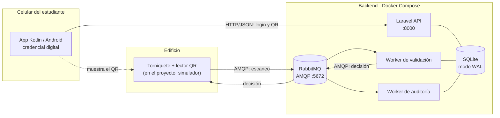
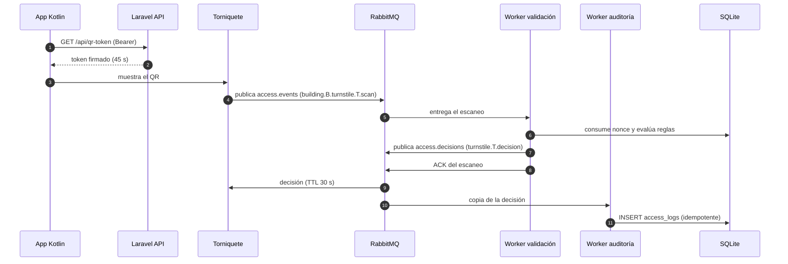

# 🚪 Control de acceso con torniquetes mediante QR dinámico y AMQP

Sistema de control de acceso para los edificios de una universidad. El estudiante presenta desde su celular
un **código QR que cambia cada pocos segundos**; el torniquete lo lee y lo publica como un **evento** en un
broker **RabbitMQ (AMQP 0-9-1)**; un backend **Laravel** lo valida, decide si abre o no y responde por la
misma vía. Todo corre en contenedores con **Docker Compose**.

> Estilo arquitectónico: **Arquitectura orientada a eventos (EDA)** con patrón **Publicador/Suscriptor**.
> El análisis completo (investigación, matrices, C4, ADRs y lecciones aprendidas) está en
> [`docs/DOCUMENTO_TECNICO.md`](docs/DOCUMENTO_TECNICO.md).

---

## 1. Descripción del sistema

### 1.1 El problema

Una universidad instala torniquetes en todos sus edificios. Los estudiantes, docentes y administrativos deben
entrar con su teléfono, y cada edificio tiene reglas distintas (quién puede entrar y en qué horario). Se busca:

- Que el QR **no sirva** si alguien le toma una captura de pantalla.
- Que agregar nuevas funciones (alertas, analítica, un panel) **no obligue a tocar** el flujo de acceso.
- Que si el sistema falla, el torniquete **falle cerrado** (no abra por error).
- Que cada acceso, permitido o negado, **quede registrado**.

### 1.2 Cómo funciona

1. La **app móvil en Kotlin** inicia sesión contra la API y pide un **token QR** firmado que vive 45 segundos.
2. El estudiante muestra el QR al lector. El **torniquete publica un evento de escaneo** en RabbitMQ.
3. El **worker de validación** consume el evento, verifica firma, vigencia y que el token no se haya usado
   (anti-replay), evalúa las reglas (rol, edificio, horario) y **publica la decisión** en la cola del torniquete.
4. El torniquete abre o niega. Si no llega decisión a tiempo, **se queda cerrado**.
5. El **worker de auditoría**, suscrito de forma independiente, registra la decisión en la base de datos.

### 1.3 Vista general



### 1.4 Flujo de un acceso



---

## 2. Aplicación móvil (Kotlin / Android)

La app es la **credencial digital** del usuario. Solo habla **HTTP/JSON** con la API: no conoce RabbitMQ ni los
torniquetes.

### 2.1 Responsabilidades

| Función | Detalle |
|---|---|
| Iniciar sesión | `POST /api/login` → guarda el token de API en almacenamiento cifrado |
| Mostrar el QR | Pide `GET /api/qr-token`, dibuja el texto del campo `token` como código QR |
| Renovar | Pide un QR nuevo cada ~30 s (el token vence a los 45 s) y muestra la cuenta regresiva |
| Cerrar sesión | `POST /api/logout` y borra el token local |

### 2.2 Contrato de la API

Todas las rutas están bajo `/api`. Las protegidas requieren `Authorization: Bearer <token>` y
`Accept: application/json`.

| Método | Ruta | Auth | Límite | Respuesta |
|---|---|---|---|---|
| POST | `/login` | No | 10/min | `{ "token": "...", "user": { "id", "name", "role" } }` |
| GET | `/qr-token` | Sí | 30/min | `{ "token": "...", "expires_at": 1790637066, "ttl": 45 }` |
| GET | `/me` | Sí | — | `{ "id", "name", "role" }` |
| POST | `/logout` | Sí | — | `{ "message": "Sesión cerrada." }` |

Códigos relevantes: `401` (token inválido → volver al login), `403` (usuario inactivo), `422` (credenciales inválidas).

### 2.3 Ejemplo de cliente (Kotlin)

```kotlin
@Serializable data class LoginRequest(
    val email: String,
    val password: String,
    @SerialName("device_name") val deviceName: String = "android",
)
@Serializable data class UserDto(val id: Int, val name: String, val role: String)
@Serializable data class LoginResponse(val token: String, val user: UserDto)
@Serializable data class QrTokenResponse(
    val token: String,
    @SerialName("expires_at") val expiresAt: Long,
    val ttl: Int,
)

interface AccessApi {
    @POST("login")    suspend fun login(@Body body: LoginRequest): LoginResponse
    @GET("qr-token")  suspend fun qrToken(): QrTokenResponse   // el Bearer lo agrega un interceptor
}

// En el ViewModel: renovar antes de que venza el TTL de 45 s
viewModelScope.launch {
    while (isActive) {
        val qr = api.qrToken()
        _uiState.value = QrUiState(content = qr.token, expiresAt = qr.expiresAt)
        delay(30_000)
    }
}
```

### 2.4 Recomendaciones para la app

- **Stack sugerido:** Kotlin 2.x, Jetpack Compose, Retrofit + OkHttp + `kotlinx.serialization`, corrutinas/Flow,
  ZXing (`com.google.zxing:core`) para dibujar el QR.
- **Seguridad:** guardar el token con `EncryptedSharedPreferences`/Keystore; activar `FLAG_SECURE` en la pantalla
  del QR para bloquear capturas; subir el brillo al mostrarlo; no registrar tokens en logs; no mostrar un QR vencido.
- **Desarrollo:** el emulador de Android ve el host en `http://10.0.2.2:8000/api/`. En un teléfono físico usa la IP
  de la máquina en la red local (con WSL2 hay que reenviar el puerto desde Windows). El tráfico HTTP sin cifrar
  solo debe permitirse en la variante *debug* mediante `network_security_config`. En producción, **HTTPS**.

---

## 3. Tecnologías

| Capa | Tecnología | Versión / nota | Para qué se usa |
|---|---|---|---|
| Lenguaje backend | PHP | 8.3 (imagen `php:8.3-cli`) | Lógica de negocio y workers |
| Framework | Laravel | 13.x | API, ORM (Eloquent), migraciones, consola (Artisan), scheduler |
| Autenticación API | Laravel Sanctum | — | Tokens de acceso para la app móvil |
| Base de datos | SQLite | modo **WAL** | Usuarios, reglas, registros de acceso, nonces |
| Broker | RabbitMQ | 4.x (`rabbitmq:4-management`) | Enrutamiento Pub/Sub, colas durables, DLQ |
| Protocolo | AMQP | 0-9-1 | Mensajería entre torniquetes y backend |
| Cliente AMQP | php-amqplib | — | Publicar y consumir desde PHP |
| Contenedores | Docker + Docker Compose | Compose v2 | Despliegue reproducible |
| Cliente móvil | Kotlin / Android | Kotlin 2.x | Credencial digital y QR dinámico |

### 3.1 Topología AMQP

| Elemento | Tipo | Detalle |
|---|---|---|
| `access.events` | exchange `topic` | Escaneos. Routing key: `building.{id}.turnstile.{id}.scan` |
| `access.decisions` | exchange `topic` | Decisiones. Routing key: `turnstile.{id}.decision` |
| `access.dlx` | exchange `topic` | Dead letters (mensajes rechazados) |
| `access.validation` | cola durable | Enlazada a `building.*.turnstile.*.scan` |
| `access.audit` | cola durable | Enlazada a `#` en `access.events` y `access.decisions` |
| `access.dlq` | cola durable | Enlazada a `access.dlx` con `#` |
| `turnstile.{id}.commands` | cola por torniquete | Recibe su decisión, con **TTL de 30 s** |

### 3.2 Contratos de mensajes

Propiedades AMQP: `content_type: application/json`, `delivery_mode: 2` (persistente), `correlation_id` (UUID del
escaneo), `message_id`, `timestamp` y `type`.

```jsonc
// type = "access.scan"  ->  access.events
{ "turnstile_id": 3, "qr_token": "<token firmado>", "scanned_at": "2026-09-29T15:41:28-05:00" }

// type = "access.decision"  ->  access.decisions
{
  "correlation_id": "0b6c…", "turnstile_id": 3, "user_id": 4,
  "granted": true, "reason": "granted",
  "scanned_at": "2026-09-29T15:41:28-05:00", "decided_at": "2026-09-29T20:41:28+00:00"
}
```

Motivos (`reason`): `granted`, `free_exit`, `turnstile_unavailable`, `user_inactive`,
`not_authorized_for_building`, `outside_schedule`, `user_not_found`, `qr_malformed`, `qr_bad_signature`,
`qr_expired`, `qr_replayed`.

### 3.3 Seguridad del QR

El QR **no contiene el ID del estudiante en claro**. Es `base64url(payload).base64url(HMAC-SHA256)` con
`payload = { u: usuario, n: nonce aleatorio, e: expiración }`. Al validar se comprueba la firma (en tiempo
constante), la vigencia y que el `nonce` no exista en `used_nonces`; su clave primaria hace el anti-replay
**atómico** (`INSERT OR IGNORE`). El worker usa **su propio reloj**, no el del dispositivo.

### 3.4 Reglas de negocio de ejemplo (seeders)

| Rol | Programa | Edificios | Horario |
|---|---|---|---|
| Estudiante | cualquiera | Biblioteca | Lun–Sáb 06:00–21:00 |
| Estudiante | ingeniería | Ingeniería | Lun–Vie 06:00–22:00 |
| Estudiante | medicina | Salud | Lun–Vie 06:00–20:00 |
| Docente | — | Biblioteca, Ingeniería, Salud | Lun–Sáb 05:00–22:00 |
| Administrativo | — | Administrativo, Biblioteca | Lun–Vie 07:00–18:00 |
| Admin | — | Todos | 24/7 |

Los torniquetes de **salida** solo exigen un QR válido (`ACCESS_FREE_EXIT=true`): nadie queda atrapado.
Las reglas se evalúan en la zona horaria del campus (`ACCESS_TIMEZONE`, por defecto `America/Bogota`).

---

## 4. Despliegue

### 4.1 Requisitos

- **Docker Engine** con **Docker Compose v2** (`docker compose version`) y **Git**.
- Puertos libres: `8000` (API), `5672` (AMQP) y `15672` (panel de RabbitMQ).
- En **Windows** usa WSL2 y clona el repositorio **dentro del sistema de archivos de Linux** (`~/proyectos/...`),
  no en `/mnt/c/...`: SQLite en modo WAL y el rendimiento de Docker lo requieren.
- Probado con Docker. Podman debería funcionar con `podman compose`, pero no se ha verificado.

### 4.2 Paso a paso

```bash
# 1. Clonar
git clone https://github.com/<usuario>/<repositorio>.git
cd <repositorio>

# 2. Variables del host (evita archivos propiedad de root en ./src)
printf "UID=$(id -u)\nGID=$(id -g)\n" > .env

# 3. Construir la imagen
docker compose build

# 4. Levantar solo RabbitMQ y esperar a que quede "healthy"
docker compose up -d rabbitmq

# 5. Preparar Laravel: dependencias, .env, clave, base SQLite, migraciones y datos de prueba
docker compose run --rm --no-deps app sh -c \
  "composer install --no-interaction && cp -n .env.example .env && php artisan key:generate \
   && touch database/database.sqlite && php artisan migrate --seed --force"

# 6. Declarar exchanges, colas y bindings en RabbitMQ
docker compose run --rm app php artisan amqp:setup-topology

# 7. Levantar todo (API, worker de validación, worker de auditoría, scheduler)
docker compose up -d
```

> Si algún worker arranca antes de que exista la topología, Docker lo reinicia solo (`restart: unless-stopped`).

### 4.3 Verificar

```bash
docker compose ps                                   # 5 servicios en "running"/"healthy"
curl -s -o /dev/null -w "%{http_code}\n" localhost:8000/up    # 200
curl -s -X POST localhost:8000/api/login \
  -H 'Accept: application/json' -H 'Content-Type: application/json' \
  -d '{"email":"ana@uni.test","password":"password"}'         # devuelve un token
```

Panel de RabbitMQ: <http://localhost:15672> (usuario `turnstile`, contraseña `turnstile_pass`).

### 4.4 Prueba de punta a punta (simulador de torniquete)

Los torniquetes de prueba son: `1` Biblioteca entrada, `2` Biblioteca salida, `3` Ingeniería entrada,
`4` Ingeniería salida, `5` Salud entrada, `6` Salud salida, `7` Administrativo entrada, `8` Administrativo salida.

```bash
docker compose exec app php artisan amqp:simulate-scan 3 ana@uni.test     # ABRE (granted)
docker compose exec app php artisan amqp:simulate-scan 5 ana@uni.test     # NIEGA (not_authorized_for_building)
docker compose exec app php artisan amqp:simulate-scan 5 luis@uni.test    # ABRE
docker compose exec app php artisan amqp:simulate-scan 2 sofia@uni.test   # ABRE (free_exit)
docker compose exec app php artisan amqp:simulate-scan 3 pedro@uni.test   # NIEGA (user_inactive)
docker compose exec app php artisan amqp:simulate-scan 3 ana@uni.test --repeat=2   # ABRE, luego NIEGA (qr_replayed)
docker compose exec app php artisan amqp:simulate-scan 3 --token=basura   # NIEGA (qr_malformed)
```

Las pruebas que dependen de horario dan `outside_schedule` si se ejecutan fuera de la franja de la regla.

Ver el registro de auditoría:

```bash
docker compose exec app sqlite3 -header -column database/database.sqlite \
 "select l.id, u.name, t.code, l.granted, l.reason, l.scanned_at
  from access_logs l left join users u on u.id=l.user_id left join turnstiles t on t.id=l.turnstile_id
  order by l.id desc limit 10;"
```

### 4.5 Usuarios de prueba

Contraseña de todos: `password` (**solo desarrollo**).

| Correo | Rol | Programa |
|---|---|---|
| `admin@uni.test` | admin | — |
| `docente@uni.test` | teacher | — |
| `staff@uni.test` | staff | — |
| `ana@uni.test` | student | ingeniería |
| `luis@uni.test` | student | medicina |
| `sofia@uni.test` | student | derecho |
| `pedro@uni.test` | student (**inactivo**) | ingeniería |

### 4.6 Operación

```bash
docker compose logs -f worker-validate worker-audit     # ver decisiones y auditoría en vivo
docker compose restart worker-validate worker-audit     # tras cambiar código PHP (no recargan solos)
docker compose exec app php artisan amqp:dlq            # inspeccionar mensajes fallidos (sin qr_token)
docker compose exec app php artisan amqp:dlq --purge    # vaciar la DLQ
docker compose exec app php artisan qr:purge-nonces     # limpiar nonces vencidos (también corre cada hora)
docker compose down                                     # detener (añade -v para borrar los datos de RabbitMQ)
```

Cambia las credenciales de RabbitMQ definiendo `RABBITMQ_USER` y `RABBITMQ_PASSWORD` en el `.env` de la raíz
**antes** del primer arranque.

---

## 5. Estructura del repositorio

```
.
├── docker-compose.yml          # app, worker-validate, worker-audit, scheduler, rabbitmq
├── Dockerfile                  # PHP 8.3 + pdo_sqlite, sockets, pcntl, bcmath + Composer
├── docker/entrypoint.sh
├── docs/DOCUMENTO_TECNICO.md   # investigación, matrices, C4, ADRs, lecciones aprendidas
├── mobile/                     # app Kotlin / Android (cliente de la API)
└── src/                        # proyecto Laravel
    ├── app/Services/Amqp/      # AmqpConnection, AmqpPublisher, Topology
    ├── app/Services/Qr/        # QrTokenService, QrValidation
    ├── app/Services/Access/    # AccessPolicyService, AccessDecision
    ├── app/Console/Commands/   # amqp:setup-topology, amqp:validate-access, amqp:audit,
    │                           # amqp:dlq, amqp:simulate-scan, qr:purge-nonces
    ├── app/Http/Controllers/Api/   # AuthController, QrTokenController
    ├── app/Models/ · app/Enums/
    ├── config/amqp.php · config/qr.php · config/access.php
    ├── database/migrations · database/seeders
    └── routes/api.php · routes/console.php
```

## 6. Limitaciones conocidas

- **SQLite** es adecuada para el piloto; en producción conviene PostgreSQL o MySQL (Laravel lo permite cambiando la conexión).
- El **torniquete es un simulador**: con hardware real haría falta un gateway por edificio que traduzca el lector a AMQP.
- El broker usa **un solo usuario** y **sin TLS**. Falta un usuario por gateway con permisos mínimos y TLS (puerto 5671).
- Sin **reintentos con backoff** ni **Transactional Outbox**; los fallos van a la DLQ.
- Todavía no hay **pruebas automatizadas**; las pruebas realizadas fueron manuales (ver el documento técnico).

## 7. Solución de problemas

| Síntoma | Causa probable | Solución |
|---|---|---|
| `"/docker/entrypoint.sh": not found` al construir | Falta la carpeta `docker/` | Verifica que `docker/entrypoint.sh` exista en la raíz |
| `database is locked` | SQLite sin WAL o proyecto en `/mnt/c` | Revisa `journal_mode`/`busy_timeout` en `config/database.php` y mueve el proyecto a Linux |
| `PRECONDITION_FAILED` al declarar colas | Cambió un argumento de una cola existente | `rabbitmqctl delete_queue <cola>` y vuelve a correr `amqp:setup-topology` |
| Workers reiniciándose | RabbitMQ aún no listo o falta la topología | Espera al *healthcheck* y ejecuta `amqp:setup-topology` |
| Permisos raros en `src/` | `.env` sin `UID`/`GID` | Repite el paso 2 y reconstruye |
| La app móvil no conecta | `localhost` en el emulador apunta al propio emulador | Usa `10.0.2.2:8000` (emulador) o la IP local (teléfono) |

## 8. Versionado y entrega

```bash
git add . && git commit -m "feat: control de acceso con torniquetes (EDA + AMQP) v1.0.0"
git push -u origin main
git tag -a v1.0.0 -m "Entrega final v1.0.0"
git push origin v1.0.0
# Release en GitHub (interfaz web, o con la CLI):
gh release create v1.0.0 --title "v1.0.0" --notes "Entrega final: flujo completo QR → AMQP → decisión → auditoría"
```

Antes de publicar, confirma que **no** se versionan `.env`, `src/.env`, `src/vendor/` ni `*.sqlite`.

## 9. Licencia y autores

Proyecto académico. Licencia: _(por definir, p. ej. MIT)_. Autores: _(nombres del grupo)_.
